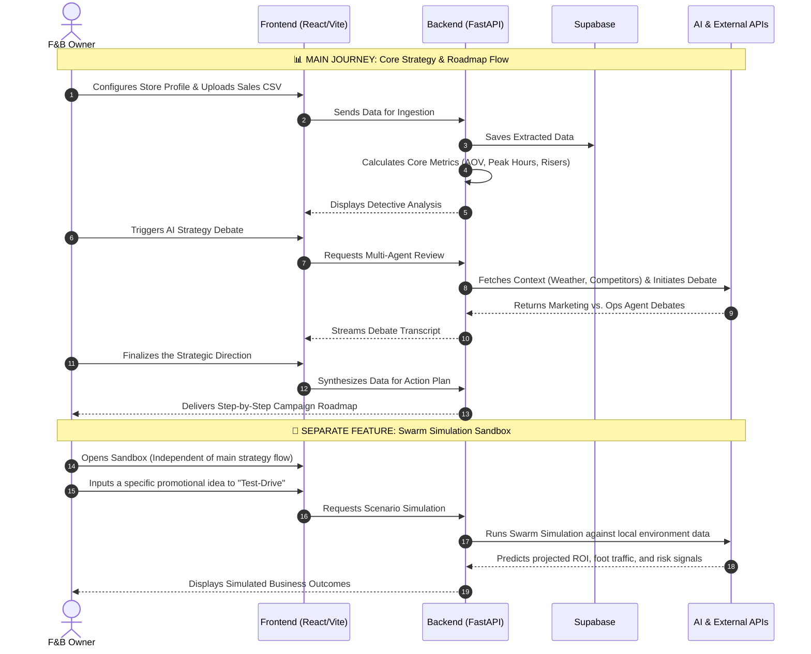
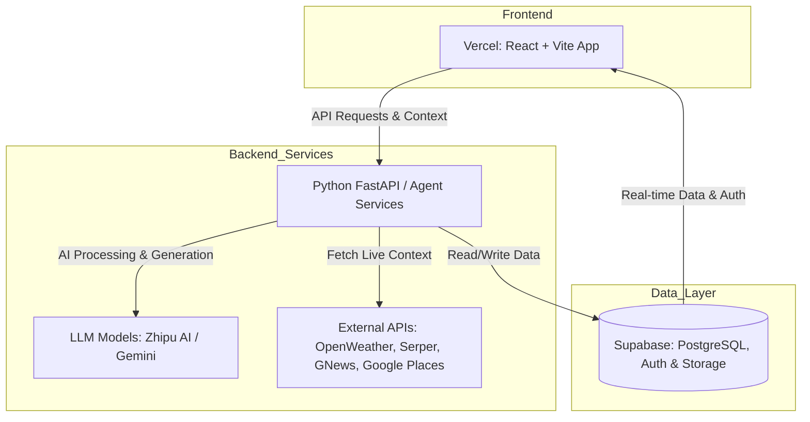

**For the PRD, SAD, TAD, please refer `PDF document` folder**

**For pitch deck, please refer `pitch_deck.html`**


# 🚀 Tauke.AI

> **UM Hackathon 2026**  
> *Your Autonomous F&B Business Analyst & Strategy Simulator*

Tauke.AI is an end-to-end intelligence platform designed to help Malaysian Food & Beverage (F&B) SMEs make data-driven decisions with more confidence. By combining document understanding, business data analysis, multi-agent strategy evaluation, and simulation-based what-if testing, Tauke.AI acts as a virtual decision-support partner for business owners.

---

## 🌐 Website URL
https://tauke-ai.vercel.app/ 

---

## ⚠️ Important Note: Waking Up the Server

Since our backend API is hosted on Render, the server may automatically go to sleep after a period of inactivity.

**Before using or testing the live application, please click the link below to wake up the backend:**

👉 [https://tauke-ai-backend.onrender.com/health](https://tauke-ai-backend.onrender.com/health)

Please allow around **30–50 seconds** for the server to spin up and return a healthy response.

---


## 📌 Problem

Many F&B SMEs want to improve their business, but they often hesitate to try new strategies because they are unsure of the outcome. Sales records, invoices, and operational information are usually stored separately, making it difficult to understand what is really happening in the business.

As a result, owners may struggle to:
- understand why profit changes from week to week
- detect hidden cost increases early
- compare possible strategies before taking action
- test new business ideas without real financial risk

Tauke.AI is built to reduce that uncertainty by turning fragmented business data into structured insights, strategic options, and actionable next steps.

---

## 💡 Solution

Tauke.AI helps business owners:
- upload CSV sales records and financial documents
- extract and organize useful business data automatically
- identify business trends, anomalies, and risk signals
- clarify uncertain findings through a guided AI-assisted flow
- generate multiple strategy options
- compare strategies through multi-agent debate
- test one specific business idea in a simulation sandbox
- receive a final recommendation together with an execution roadmap

In short, Tauke.AI helps F&B SMEs make safer and more informed decisions before committing time, budget, or effort in the real world.

---

## ✨ Core Features

### 📄 Automated Financial Ingestion
Upload PDF Profit & Loss statements or supplier invoices. The system uses Vision AI to extract, structure, and categorize expense and revenue information automatically.

### 📊 Detective Analysis
Upload CSV sales logs to identify:
- peak hours
- average order value (AOV)
- top-rising menu items
- top-falling menu items
- possible performance patterns and business issues

### 👔 AI Boardroom
Tauke.AI includes a multi-stage strategy workflow:
- **Interrogation** — the AI analyst reviews diagnostic patterns and asks targeted follow-up questions to gather real-world business context
- **Multi-Agent Debate** — multiple AI personas evaluate different recovery or growth strategies from different business perspectives
- **Final Synthesis** — the system consolidates those perspectives into a recommended strategic direction

### 🧪 MiroFish Swarm Simulation (Sandbox)
Test business ideas safely before committing real budget. Instead of using basic math formulas, our engine builds a hyper-realistic 'digital twin' of your market. The system dynamically generates hundreds of unique AI agents perfectly mapped to your actual customer base distribution. By injecting each agent with randomized personalities, budgets, and behavioral quirks, we create a highly creative, unpredictable simulation. Watch this living digital market react to your new promotions or price changes in real-time, driven by your internal data and live external signals.

### 🗺️ Dynamic Execution Roadmaps
Once a strategy is selected, Tauke.AI converts it into an actionable step-by-step roadmap adapted to local conditions and business context.

---


## 🗺️ User Journey

A typical user journey in Tauke.AI looks like this:

1. **Configure the business/store profile**
2. **Upload CSV sales data and financial documents**
3. **Review detective analysis and identified trends**
4. **Answer clarification questions if needed**
5. **Generate and compare strategic options**
6. **Run a simulation for a specific business idea if desired**
7. **Review the final recommendation**
8. **Follow the generated execution roadmap**





---

## 🏗️ Architecture & Tech Stack

### Frontend (`/tauke-ai-web`)
A responsive single-page application built for speed and usability.

- **Framework:** React + Vite
- **Routing:** React Router
- **UI Structure:** JSX
- **Styling:** CSS / custom UI components
- **Client Integration:** Supabase Client

### Backend (`/backend`)
A Python API layer responsible for LLM orchestration, ingestion, analysis, and structured processing.

- **Framework:** FastAPI + Uvicorn
- **Language:** Python
- **Database:** Supabase (PostgreSQL)
- **AI / LLM Integration:** ZhipuAI and ILMU API
- **Data Processing:** Pandas, PyMuPDF (`fitz`)

### External Data Integrations
Tauke.AI also incorporates selected external context signals:

- **Google Places API** — nearby competitor density and location context
- **OpenWeather API** — real-time and historical weather signals
- **GNews API** — local events and macro context
- **Google Routes / BestTime API** — traffic and footfall signals

---

## 🏗️ System Architecture

Based on our exact tech stack, separating the React frontend, Python AI backend, Supabase data layer, and external intelligence APIs.





## 🚀 Local Development Setup

### Prerequisites
Make sure you have the following installed:

- **Node.js** v18+
- **Python** 3.10+
- a **Supabase project**

---

## 1. Clone the Repository

```bash
git clone https://github.com/Gohpeijia/UM-Hackathon-2026.git
cd UM-Hackathon-2026
```

---

## 2. Backend Setup

Navigate to the backend directory and install dependencies:

```bash
cd backend
pip install -r requirements.txt
```

Create a `.env` file inside the `backend` directory:

```env
# Database
SUPABASE_URL=your_supabase_project_url
SUPABASE_SERVICE_ROLE_KEY=your_supabase_service_role_key
SUPABASE_KEY=your_supabase_anon_key

# AI Models
ZHIPU_API_KEY=your_zhipu_api_key_here
ILMU_API_KEY=your_ilmu_api_key_here
ILMU_MODEL=ilmu-glm-5.1

# External Signals
GOOGLE_PLACES_API_KEY=your_google_places_api_key
OPENWEATHER_API_KEY=your_openweather_api_key
GNEWS_API_KEY=your_gnews_api_key
BESTTIME_API_KEY=your_besttime_api_key
SERPER_API_KEY=your_serper_api_key
```

Start the backend server:

```bash
uvicorn vision_service:app --host 0.0.0.0 --port 8001 --reload
```

The backend API will be available at:

```text
http://localhost:8001
```

---

## 3. Frontend Setup

Open a new terminal and navigate to the frontend directory:

```bash
cd tauke-ai-web
npm install
```

Configure your frontend environment variables in `.env` or the relevant frontend config:

```env
VITE_SUPABASE_URL=your_supabase_project_url
VITE_SUPABASE_ANON_KEY=your_supabase_anon_key
VITE_API_BASE_URL=http://localhost:8001
```

Start the frontend:

```bash
npm run dev
```

---

## 🔄 Project Structure

```text
UM-Hackathon-2026/
├── backend/
│   ├── vision_service.py
│   ├── agent_tools.py
│   ├── requirements.txt
│   └── ...
├── tauke-ai-web/
│   ├── src/
│   ├── package.json
│   └── ...
└── README.md
```

---

## 🛡️ Reliability & Safeguards

Tauke.AI includes multiple safeguards to improve reliability and reduce unsafe AI output:

### LLM Fallback Logic
If the primary ILMU path fails or times out, the backend can degrade gracefully to alternative invocation logic.

### JSON Auto-Repair
Malformed or truncated AI JSON outputs are repaired or cleaned before they are stored or reused.

### Profit-Driven Overrides
If the simulator produces a recommendation that conflicts with projected business outcomes, backend guardrails can override that output.

### Idempotent Ingestion
Sales data ingestion is designed to prevent duplicate stacking when files are re-uploaded.

---

## 🧪 Testing Notes

For documentation and QA purposes, the following flows are important to validate:

- business profile creation
- file upload success and failure handling
- CSV and invoice parsing
- detective analysis output relevance
- clarification flow behavior
- strategy generation quality
- debate flow continuity
- simulation result handling
- final recommendation and roadmap generation

---

## 👥 Team

Designed and developed by **Team Tauke.AI** for **UM Hackathon 2026**.

---

## 📌 Notes

- Make sure all required API keys are configured before running the system.
- Do not expose real secrets in the public repository.
- Wake the hosted backend first before testing the live deployment.
